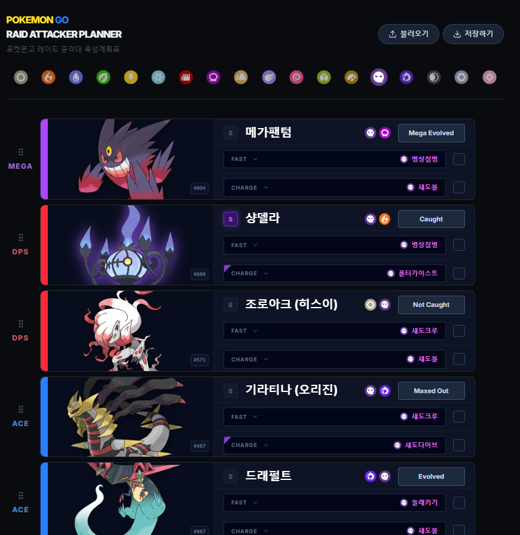

<div align="center">

</div>

# Pokemon GO Raid Attacker Planner (KR)
> 국문 명칭: 포켓몬고 레이드 공격대 육성계획표 (한국어 버전)

이 리포지토리는 모바일게임 포켓몬고의 모든 포켓몬들을 이용하여 6마리의 조합을 시뮬레이션하고 육성 진행도를 표기/저장/복원할 수 있는 웹사이트의 소스코드를 가지고 있습니다.  
이 사이트의 모든 이미지 데이터는 주식회사 나이언틱(Niantic.) 및 주식회사 포켓몬(The Pokémon Company | 株式会社ポケモン | Pokémon, Inc.) 의 소유이며, 웹사이트의 소스코드 저작권은 제작자(github id: justin212553)에게 있음을 밝힙니다.

## 버전 정보
```
마지막 업데이트: PST 2026. 05. 04 
```
## 사용 방법
<div align="center">

</div>

상단에 있는 18개의 타입 아이콘들을 클릭하여 각 타입별 포켓몬들을 필터링 할 수 있습니다. 각 속성 별로 최대 6마리의 포켓몬을 지정할 수 있으며, 이 포켓몬들의 그림자 포켓몬 여부, 메가진화 에너지 여부, 육성 상황을 지정할 수 있습니다.

또한, 퀵 무브나 차지 무브가 대단한기술머신 혹은 운석 등 특별한 아이템을 필요로 하는 레거시 기술일 시, 예시 사진 속 기라티나(오리진)의 '섀도다이브' 처럼 보라색 작은 표시가 됩니다.

모든 타입의 공격대는 1번 포켓몬이 MEGA(메가진화) 포켓몬, 2-3번 포켓몬이 DPS(유리대포) 포켓몬, 4-5번 포켓몬이 ACE(에이스) 포켓몬, 6번 포켓몬이 TANK(탱커) 포켓몬으로 역할군이 지정되어 있으나, 이는 참고용이며 1번 메가진화 포켓몬의 자리 빼고 타입에 맞는 모든 포켓몬을 지정할 수 있습니다. 섀도볼 다크라이 등 특별한 이유가 있는 경우를 제외하고 모두 자속 보정이 있는 동일 타입 기술로 통일한다는 전제 하에 만들어졌습니다.

불러오기/저장하기 버튼을 누를 시 json 형식으로 모든 타입의 공격대 정보를 저장하거나 불러올 수 있습니다.


## 제작자 정보
제작자: 아이작 블루 (@Friday_3233 of X)

<div align="center">

</div>

```
이 웹사이트의 일부 기능은 Google AI Studio를 이용하여 만들어졌음을 밝힙니다.
```